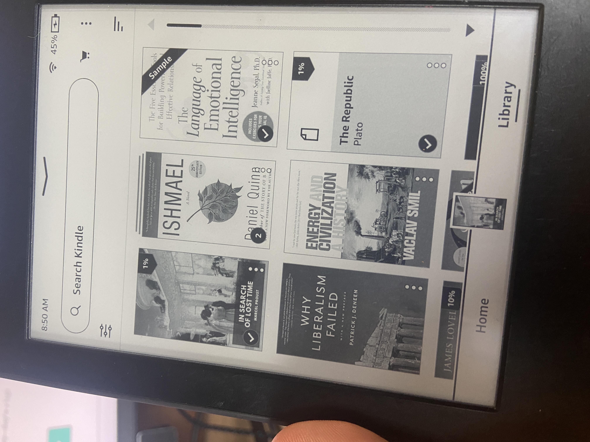

Standard Ebooks provides well-formatted ebooks of works that have entered the public domain, for free. This is typically (in the US) 70 years after the author's death. 

For locally opened `.azw3` files used for Kindle, the book and thumbnail must be added manually to the connected device. 
1. Connect the Kindle
2. Drag the `.azw3` file into the `(device)/Documents` folder
3. Drag and drop the thumbnail file (provided by Standard Ebooks) into `(device)/System/thumbnails` 
4. Eject the Kindle and you should see the book with your thumbnail

> [!TIP] 
> Note that `System` will be a hidden folder within the Kindle device

> [!CAUTION] 
> This book and any highlights will only be available locally, so you won't see this in the Kindle app and the highlights won't appear in the cloud - only in the local `Clippings.txt` file. 

> [!CAUTION]
> Do **not** open .`azw3` file directly on the computer, as it will appear in the _computer's_ local books, **not** on the Kindle's. 
> 
> 
> | Incorrect (local to computer)                                     | Correct (local to kindle)     |
> | ----------------------------------------------------------------- | ----------------------------- |
> |  |  |
> 

Source - https://standardebooks.org/help/how-to-use-our-ebooks#kindle-method-1