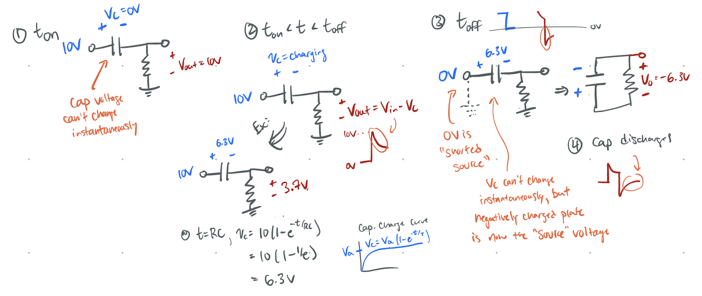

Today I learned (or re-learned) a more intuitive way to understand why the falling edge pulse into a series (high-pass/differentiator) capacitor results in a negative output voltage _even when the input voltage is positive_. 

From Hayes' _Learning the Art of Electronics_ section 2W.2.2 on the response of various RC circuits:

![[attachments/capacitor-response-highpass.png]]
> When the input pulse width is close to the RC time constant, we will see the charge/discharge response of the capacitor as a differentiator. 

The intuitive way of seeing this is as follows:
- right before the falling clock/pulse edge the capacitor has charged up to some value [^1], say 6.3V (thus the output is $V_{In}-V_C = 3.7$)
- when the pulse goes to zero, the input is zero, but the voltage across the capacitor can't change instantaneously
- redraw the circuit (see below) and label the capacitor voltage polarity, note now the negatively charged "plate" (right side) is now the voltage source that is across the output voltage
- thus when the circuit switches off, whatever charge was stored on the capacitor now feeds the output, which is negative due to the negative side of the capacitor being connected to the output voltage and the input being a short to ground (0V)

[^1]: This assumes that the RC time constant is small enough compared to the pulse width such that the capacitor has time to appreciably charge (i.e. $t_{pulse} < 5RC$).