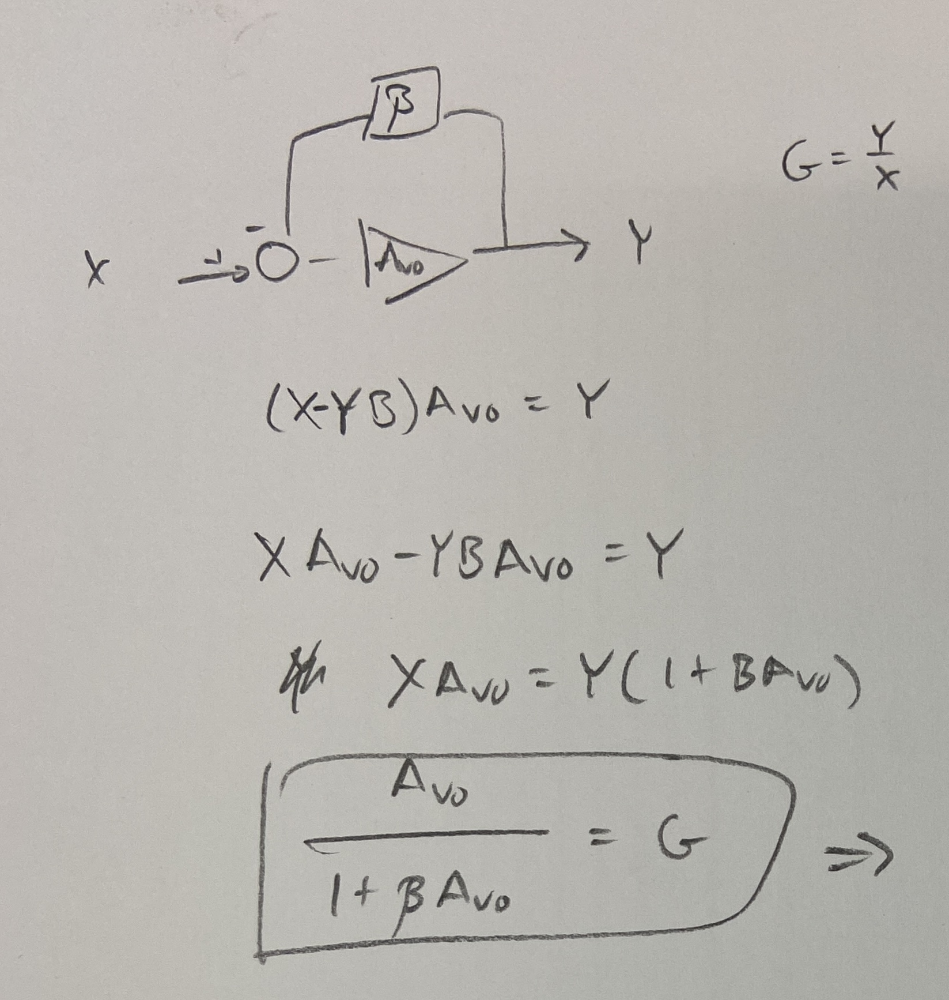

How do we quantify the error effects of finite gain? Even for an otherwise ideal op-amp, finite gain reveals a non-ideality in the closed loop gain equation. Using Jung's _IC Op Amp Cookbook_ and Roberge's _Operational Amplifiers: Theory and Practice_, we can gain valuable insights from the derivation of the closed loop gain result:

$$
A_v= -\frac{R_f}{R_{in}}\frac{1}{1+1/(A_{vo}\beta)}
$$

First, we define a term, $\beta$ , in operational amplifier circuits employing feedback as the amount of output that is fed back to the input. Interestingly, we then call $\frac{1}{\beta}$ as the "noise gain", which is common for both non-inverting and inverting configurations. 

We can then analyze the closed loop gain in terms of the open loop gain and this $\beta$ term, noting how for high open loop gain $A_{vo}$ we get a closed loop gain equal to $\frac{1}{\beta}$ which is determine by components external to the op-amp. 

In Jung's industry classic [1], Section 1.2.1 "Errors Due to Finite Open-Loop Gain", he presents an equation for the closed loop gain of the inverting amplifier:

But it is not clear how he separates the ideal expression from the error multiplier terms. Clarity can be found by referencing the Roberge text [2] (available freely [online](https://eng.libretexts.org/Bookshelves/Electrical_Engineering/Electronics/Operational_Amplifiers%3A_Theory_and_Practice_(Roberge)/01%3A_Background_and_Objectives/1.02%3A_The_Closed-loop_Gain_of_an_Operational_Amplifier)). 

For the inverting amplifier configuration, assuming no current flows into the op-amp, we can solve for the closed loop gain via superposition (see text):

$$
A_{v}=-\frac{A_{vo}Z_2/(Z_1+Z_2)}{1+[A_{vo}Z_1/(Z_1+Z_2)}
$$

Then with some algebraic manipulations, we can finally derive the Jung equation.
Since $\beta = \frac{Z_1}{Z_1+Z_2}$:
$$
\begin{aligned}
A_{v}&=-\frac{A_{vo}Z_2/(Z_1+Z_2)}{1+[A_{vo}Z_1/(Z_1+Z_2)} \\ 
&= -\frac{A_{vo}Z_2/(Z_1+Z_2)}{1+A_{vo}\beta} \\ 
&=- \frac{Z_2}{Z_1+Z_2}\frac{A_{vo}}{1+A_{vo}\beta} \\ 
&=-Z_2\frac{\beta}{Z_1}\frac{A_{vo}}{1+A_{vo}\beta} \\ 
&= -\frac{Z_2}{Z_1}\frac{1}{1+1/(A_{vo}\beta)}
\end{aligned}
$$

Where the $\frac{-Z_2}{Z_1}$ term is the one we expect for the ideal inverting amplifier. Thus the other term is an error term depending on $A_{vo}\beta$. For small values of $A_{vo}\beta$, this error term becomes less than 1, decreasing our overall gain.

This shows the effects of non infinite open loop gain of the op-amp. This actually becomes important at higher frequencies for unity gain amplifiers as the open loop gain of the op-amp itself decreases and the $A_{vo}\beta$ starts to play more of a role.

TODO - give more practical reasons

## References

[1] **W. G. Jung**, _IC Op-Amp Cookbook_, 1st ed., 2nd printing. Indianapolis, IN: Howard W. Sams, 1976.
[2] **B. Roberge**, _Operational Amplifiers: Theory and Practice_. New York: Wiley, 1976. Available freely [online](https://eng.libretexts.org/Bookshelves/Electrical_Engineering/Electronics/Operational_Amplifiers%3A_Theory_and_Practice_(Roberge)/01%3A_Background_and_Objectives/1.02%3A_The_Closed-loop_Gain_of_an_Operational_Amplifier).