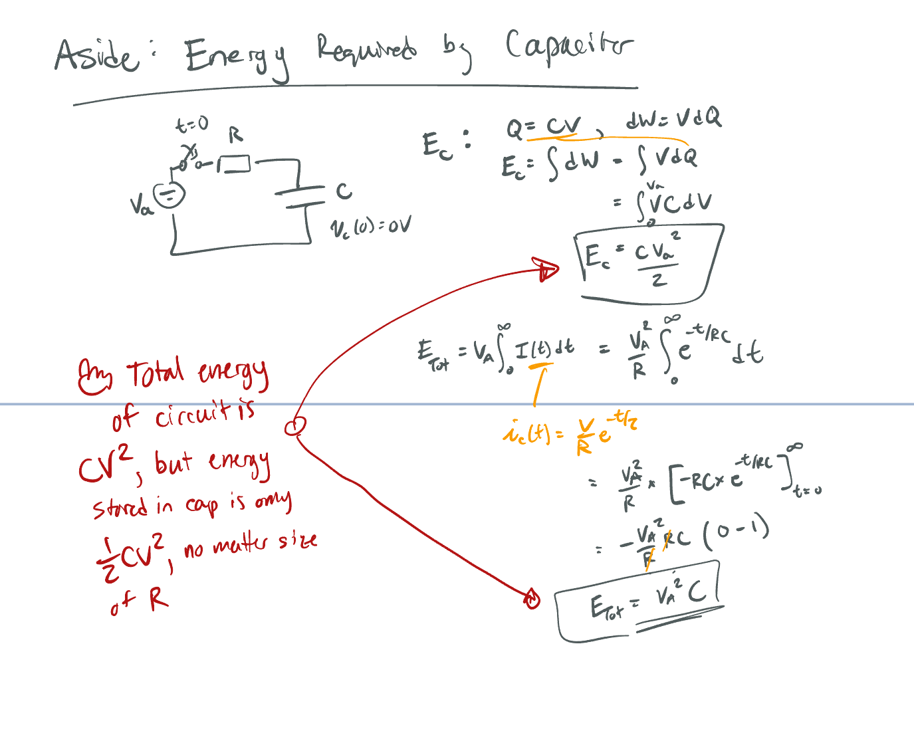

The energy required (from e.g. a battery) to charge a capacitor from 0 to $V_A$ is $E=CV_A^2$, but the energy stored by the capacitor is only $E_C = \frac{1}{2}CV_A^2$. 

This is important for digital circuits, since every time we switch an output from 0 to 1 we have to charge the line capacitance up to $V_{DD}$, thus we use up $CV_{DD}^2$, and on the discharge we don't use up any energy from the supply.

Also note that $\frac{1}{2}CV^2$ is _dissipated_ at _each_ switching occurrence, since of course the stored energy in the line capacitance must be discharged somewhere - this is important for thermal considerations especially at high speeds.

[Hyperphysics](http://hyperphysics.phy-astr.gsu.edu/hbase/electric/capeng2.html) notes that even if we decrease R toward 0, the current charging the capacitor grows large and thus  $P_{dis}=I^2R$ is also large. For high speeds there is a point when this energy is not dissipated by the resistor but radiated as electromagnetic radiation -- there is still no free lunch and we only get $E_C = \frac{1}{2}CV^2$ into the capacitor but use up $E=CV^2$ from the power source.

A simplified "proof" is shown below, note that the R term drops out of the $E_{Tot}$ equation:

